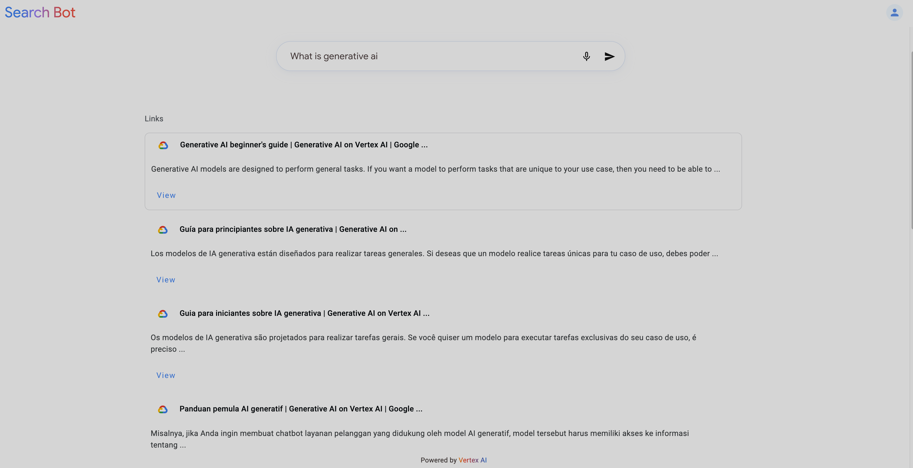

# QuickBot - Website Search using Custom RAG

QuickBot Website Search Template is a powerful website search application. It features a user-friendly frontend interface and a robust backend API that leverages a custom Google Cloud Function for its Retrieval Augmented Generation (RAG) capabilities.

## Overview

This project allows users to perform intelligent searches over website content. The backend uses a custom Google Cloud Function (e.g., `create-intent-index`) for processing website data, generating embeddings, and managing the search index. This README guides you through setting up the necessary cloud infrastructure (primarily the Cloud Function) and then running both the frontend and backend components.

## Demo

See the Website Search Template in action, learning from a live website:



## Prerequisites

Before you begin, ensure you have the following installed:

*   **Google Cloud SDK (`gcloud` CLI):** Essential for authentication, deploying the Cloud Function, and interacting with Google Cloud services.
*   **Docker and Docker Compose v2:** Recommended for running the frontend and backend services in a containerized environment.
    *   Verify your Docker Compose version with `docker compose version`.
*   **Python 3.10+:** Required if you choose the manual setup path for the backend.
*   **Node.js and npm (or yarn):** Required if you choose the manual setup path for the frontend.

## Getting Started

The setup process involves two main phases:
1.  **Initial Cloud Setup:** Deploying the essential Google Cloud Function.
2.  **Running the Application:** Choosing between Docker Compose or manual setup for the frontend and backend.

### Phase 1: Initial Cloud Setup (Required for All Run Options)

This phase ensures the core cloud infrastructure, specifically the RAG Cloud Function, is deployed.

#### 1. Configure Google Cloud (`gcloud`)

Authenticate with `gcloud` and set your default project. This account will be used to deploy the Cloud Function and for the application to interact with other GCP services.

```
# Log in with your Google account
gcloud auth login

# Set your active Google Cloud project
gcloud config set project <your-gcp-project-id>

# Set up Application Default Credentials (ADC) for local development
# This allows your local application to authenticate as you.
gcloud auth application-default login
gcloud auth application-default set-quota-project <your-gcp-project-id>

# Verify your configuration
gcloud auth list
gcloud config list project
```
Replace `<your-gcp-project-id>` with your actual Google Cloud Project ID.

#### 2. Deploy the RAG Cloud Function (e.g., `create-intent-index`)

The backend relies on this Cloud Function for its RAG capabilities.

**Function Details (Example):**
*   **Name:** `create-intent-index` (you can choose another name, but be consistent)
*   **Source Location (relative to project root):** `functions/create-intent`
*   **Entry Point:** `create_intent_index`
*   **Runtime:** `python311` (or as specified in the function's `requirements.txt`)
*   **Region:** Choose a GCP region (e.g., `us-central1`)

**Deployment Steps:**

1.  **Ensure you are in the project root directory.**
2.  **Deploy the Cloud Function using `gcloud`:**
    Replace `<your-chosen-function-name>`, `<your-gcp-project-id>`, and `<your-chosen-region>` with your actual values.
    ```
    gcloud functions deploy <your-chosen-function-name> \
      --project=<your-gcp-project-id> \
      --gen2 \
      --runtime=python311 \
      --region=<your-chosen-region> \
      --source=./functions/create-intent \
      --entry-point=create_intent_index \
      --trigger-http \
      --allow-unauthenticated \
      --memory=1Gi \
      --timeout=3600s
    ```
    *   **Note:** `--allow-unauthenticated` is used here for development simplicity. For production, you should configure IAM to secure your Cloud Function and grant specific invoker permissions.
    *   The deployment process might take a few minutes.

3.  **Retrieve the Deployed Function's URL and Name:**
    After successful deployment, you need the HTTP trigger URL and the exact name you used.
    ```
    # Get the URL
    gcloud run services describe <your-chosen-function-name> \
      --project=<your-gcp-project-id> \
      --region=<your-chosen-region> \
      --format="value(status.url)"
    ```
    **Important:** Carefully note down the `<your-chosen-function-name>` you used and the `FUNCTION_URL` output by the command above. You will need these for the environment variable configuration in the next phase.

#### 3. Prepare Environment Variable Values

After deploying the Cloud Function, you will have the following critical pieces of information:
*   Your `<your-gcp-project-id>`
*   The `<your-chosen-region>` for the Cloud Function
*   The `<your-chosen-function-name>`
*   The `FUNCTION_URL` (retrieved in the previous step)

You will need to use these values to configure your application.

*   **For Docker Compose:** You will directly edit the `docker-compose.yml` file.
*   **For Manual Setup:** You will create a `backend/.local.env` file.

#### 4. Run Backend Setup Script (e.g., for BigQuery)

The backend might have a setup script (e.g., `backend/setup.py`) to initialize resources like BigQuery tables. Run this after configuring your `gcloud` and ensuring the necessary environment variables (like `GCP_PROJECT_ID`, `BIG_QUERY_DATASET`) are available in your shell.

*   Temporarily set environment variables if not using a sourced `.env` file for this step:
    ```
    export GCP_PROJECT_ID="<your-gcp-project-id>"
    export BIG_QUERY_DATASET="quickbot_website_search_bq" # Or your chosen name
    # ... any other vars needed by setup.py
    ```
*   Run the script:
    ```
    python3 backend/setup.py
    ```

### Phase 2: Running the Application

After completing Phase 1, choose one of the following options:

#### Option 1: Using Docker Compose (Recommended for Quick Start)

This option runs the backend and frontend services within Docker containers. It assumes the Cloud Function is already deployed (Phase 1).

1.  **Ensure Docker and Docker Compose v2 are installed and running.**
2.  **Navigate to the project root directory.**
3.  **Configure `docker-compose.yml`:**
    Open your `docker-compose.yml` file. Locate the `environment` section for your `backend` service (and `frontend` service, if applicable). You will need to set the environment variables directly here using the values obtained in "Phase 1".

    **Example `docker-compose.yml` backend service snippet:**
    ```yaml
    services:
      backend:
        # ... build context, Dockerfile ...
        environment:
          - GCP_PROJECT_ID=<your-gcp-project-id>
          - GCP_REGION=<your-chosen-region>
          - FUNCTION_URL=<function_url_retrieved_in_phase_1_step_2>
          - BIG_QUERY_DATASET=quickbot_website_search_bq # Or your chosen name
          - ENVIRONMENT=development
          - FRONTEND_URL=http://localhost:4200 # Or the frontend container's address
          # - GOOGLE_APPLICATION_CREDENTIALS=/root/.config/gcloud/application_default_credentials.json # If mounting ADC
        # volumes:
          # - ~/.config/gcloud/application_default_credentials.json:/root/.config/gcloud/application_default_credentials.json:ro # For ADC
        ports:
          - "8080:8080" # Or your backend port
      # frontend:
      #   ...
      #   environment:
      #     - REACT_APP_API_URL=http://localhost:8080/api # Example for frontend
    ```
    Replace the placeholder values (e.g., `<your-gcp-project-id>`) with your actual values.

4.  **Build Docker Images:**
    ```
    docker compose build
    ```
5.  **Run the application:**
    ```
    docker compose up
    ```
    The frontend should typically be available at `http://localhost:4200` (or as configured) and the backend API at `http://localhost:8080`.

#### Option 2: Manual Setup (for Development and Customization)

Follow these steps if you prefer to run the frontend and backend services manually on your local machine. This requires the Cloud Function to be deployed (Phase 1).

**A. Backend Setup**

1.  **Navigate to the `backend/` directory.**
    ```
    cd backend
    ```
2.  **Create a virtual environment and install dependencies (if not already done):**
    ```
    python3 -m venv .venv
    source .venv/bin/activate
    pip3 install -r requirements.txt
    ```
3.  **Configure Environment Variables for Manual Run:**
    Create a `.local.env` file in the `backend/` directory using the values from "Phase 1".
    **Example `backend/.local.env`:**
    ```env
    GCP_PROJECT_ID="<your-gcp-project-id>"
    GCP_REGION="<your-chosen-region>"
    FUNCTION_URL="<function_url_retrieved_in_phase_1_step_2>"
    ENVIRONMENT="development"
    FRONTEND_URL="http://localhost:4200"
    BIG_QUERY_DATASET="quickbot_website_search_bq"
    ```
4.  **Source the local environment variables:**
    *   **For Mac/Windows (or zsh console on Linux):**
        ```
        . ./.local.env
        ```
    *   **For Linux (bash):**
        Modify `backend/.venv/bin/activate` to include exports from `.local.env` (see previous README examples for how to do this). Then re-activate.
    Verify with `env`.

5.  **Run the backend application:**
    ```
    # from the backend/ directory, with .venv active and .local.env sourced
    uvicorn main:app --reload --port 8080
    ```

**B. Frontend Setup**

(These instructions assume a typical TypeScript/Angular frontend. Adjust as necessary based on your `frontend/README.md`.)

1.  **Navigate to the `frontend/` directory.**
    ```
    cd frontend
    ```
2.  **Install dependencies:**
    ```
    npm install
    ```
3.  **Environment Variables (if applicable):**
    The frontend might require its own environment configuration (e.g., via a `.env` file or Angular's `environment.ts` files to point to the backend API at `http://localhost:8080`). Check the `frontend/` directory or its `README.md` for specific instructions.
4.  **Run the frontend application:**
    ```
    npm start
    # Or, for many Angular projects:
    # ng serve
    ```
    The application will typically be available at `http://localhost:4200`.

## Project Structure (highlighting important parts)
```text
website-search-using-custom-rag/
├── backend/                # Python backend (FastAPI/Uvicorn)
│   ├── .venv/              # Python virtual environment (gitignored)
│   ├── .local.env          # Local environment variables for manual run (gitignored)
│   ├── main.py             # Main application file
│   ├── requirements.txt    # Backend dependencies
│   ├── setup.py            # Backend setup script (e.g., for BigQuery)
│   └── README.md           # Backend-specific instructions
├── frontend/               # TypeScript frontend (e.g., Angular)
│   ├── node_modules/       # Node.js dependencies (gitignored)
│   ├── src/                # Frontend source code
│   ├── package.json        # Frontend dependencies and scripts
│   └── README.md           # Frontend-specific instructions
├── functions/              # Source code for Google Cloud Functions
│   └── create-intent/      # Example: Source for the RAG Cloud Function
│       └── ...
├── docker-compose.yml      # Docker Compose configuration for all services
└── README.md               # This file: Root project README
```

## Environment Variables

Configuration for both frontend and backend is primarily managed through environment variables.

*   **Backend:**
    *   When running manually, backend environment variables are defined in `backend/.local.env`.
    *   When running with Docker, these variables are set directly in the `environment` section of the `backend` service in `docker-compose.yml`.
    *   Key variables include:
        *   `GCP_PROJECT_ID`: Your Google Cloud Project ID.
        *   `GCP_REGION`: The GCP region where your Cloud Function is deployed.
        *   `FUNCTION_URL`: The HTTP trigger URL of your deployed RAG Cloud Function.
        *   `BIG_QUERY_DATASET`: (If used) Name of the BigQuery dataset.
        *   `ENVIRONMENT`: Application environment (e.g., `development`, `production`).
        *   `FRONTEND_URL`: URL of the frontend application (e.g., `http://localhost:4200`) for CORS.
    *   Consult `backend/.local.env.example` (if one exists) or the backend's configuration logic for a complete list.

*   **Frontend:**
    *   Frontend environment variables (e.g., API endpoint URLs) are usually managed within the frontend's build system (e.g., Angular's `environment.ts` files or a `.env` file in the `frontend/` directory).
    *   Consult `frontend/README.md` for specific details.

## Code Styling & Commit Guidelines

To maintain code quality and consistency across the project:

*   **TypeScript (Frontend):** We follow the Angular Coding Style Guide by leveraging Google's TypeScript Style Guide using `gts`. This includes a formatter, linter, and automatic code fixer.
*   **Python (Backend):** We adhere to the Google Python Style Guide, using tools like `pylint` and `black` for linting and formatting.
*   **Commit Messages:** We suggest following Angular's Commit Message Guidelines to create clear and descriptive commit messages.

### Frontend (TypeScript with `gts`)

(Assumes setup within the `frontend/` directory)

1.  **Initialize `gts` (if not already done in the project):**
    Navigate to `frontend/` and run:
    ```bash
    npx gts init
    ```
    This will set up `gts` and create necessary configuration files (like `tsconfig.json`). Ensure your `tsconfig.json` (or a related `gts` config file like `.gtsrc`) includes an extension for `gts` defaults, typically:
    ```json
    {
      "extends": "./node_modules/gts/tsconfig-google.json"
      // ... other configurations
    }
    ```
2.  **Check for linting issues:**
    (This assumes a `lint` script is defined in `frontend/package.json`, e.g., `"lint": "gts lint"`)
    ```bash
    # from frontend/ directory
    npm run lint
    ```
3.  **Fix linting issues automatically (where possible):**
    (This assumes a `fix` script is defined in `frontend/package.json`, e.g., `"fix": "gts fix"`)
    ```bash
    # from frontend/ directory
    npm run fix
    ```

### Backend (Python with `pylint` and `black`)

(Assumes setup within the `backend/` directory and its virtual environment activated)

1.  **Ensure Dependencies are Installed:**
    Add `pylint` and `black` to your `backend/requirements.txt` file if not already present:
    ```
    pylint
    black
    ```
    Then install them within your virtual environment:
    ```bash
    # from backend/ directory, with .venv activated
    pip3 install pylint black
    # or pip3 install -r requirements.txt
    ```
2.  **Configure `pylint`:**
    It's recommended to have a `.pylintrc` file in your `backend/` directory to configure `pylint` rules. You can generate one if it doesn't exist:
    ```bash
    # from backend/ directory
    pylint --generate-rcfile > .pylintrc
    ```
    Customize this file according to your project's needs and the Google Python Style Guide.
3.  **Check for linting issues with `pylint`:**
    Navigate to the `backend/` directory and run:
    ```bash
    # from backend/ directory
    pylint .
    # Or specify modules/packages: pylint src/ your_module_name
    ```
4.  **Format code with `black`:**
    To automatically format all Python files in the `backend/` directory and its subdirectories:
    ```bash
    # from backend/ directory
    python3 -m black . --line-length=80
    ```
